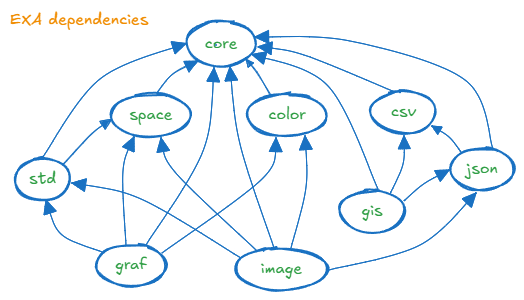

# 𝔼𝕏tr𝔸 𝔼li𝕏ir 𝔸dditions (𝔼𝕏𝔸)

𝔼𝕏𝔸ctly 10¹⁸ 𝔼𝕏𝔸lted 𝔼𝕏𝔸mples of 𝔼li𝕏ir.

EXA is a collection of utility libraries for Elixir.

## Domains

The main targets of development are:
- utils for Elixir datatypes (Core)
- standard library for new data structures (Std)
- parsing/serialization I/O for various formats
- simple domain models for existing standards
- spatial types (2D, 3D)
- some 2D computational geometry
- colors (byte, hex, float, names) and color model conversion
- bitmaps and images (I, IA, RGB, RGBA) and image I/O
- image processing (r/w, subimage, reflect, rotate, resize, filter, etc.)
- fonts (read, process, index, unicode, symbols)
- graphics (2D, image, text, 3D)
- GIS geometry and file formats (CSV, GeoJSON).
- some web stuff (XML, HTML, CSS, SVG)
- graph formats (GraphViz DOT, Erlang digraph, adjacency)
- some simple graph algorithms
- other data formats (CSV, JSON, XML)

This EXA repo is just the index for all the individual libraries.

It also contains a _mix_ task to generate 
consistent dependencies for all EXA libraries.

## Principles

The general approach for EXA is:
- self-contained:
  - all the code is here - minimize 3rd party library dependencies 
  - pure Elixir - minimize native code interfaces (NIF)
- performance:
  - not highly optimized, but not stupidly inefficient
  - Elixir is not C (or Rust), there is no inline mutability
  - some data-parallel implementations (e.g. image processing)
  - use _benchee_ for benchmarking
- quality:
  - not production quality 
  - test suite is sparse
  - starting point for custom solutions
- code style:
  - follow Elixir patterns and practices
  - no macro meta-programming (maybe some in the future)
  - old-style typespecs, for documentation, as much as for dialyzer
  - separate modules for types and constants
  - use standard tools, e.g. Logger, ExUnit, ExDoc
  - only use tools that work in git bash shell
- packaging:
  - all libraries all the way
  - no web service APIs
  - no containers, Docker, K8s, or cloud deployment
  
EXA is broad, shallow and open to change,
rather than narrow, deep and immutable.

EXA aims to be as self-contained as possible, 
but there are some exceptions:
- contains a fork of WX E3D Erlang for image handling
- use of WX native interfaces for OpenGL and WX UI
- (possible use of the _Nx_ Elixir tensor library in the future)

There are some command line interfaces to installed programs:
- GraphViz DOT for drawing directed graphs
- FFMPEG (ffmpeg, ffprobe, ffplay) for video processing

## Libraries

Contents:

- [Exa Core](#exa-core)
- [Exa Standard Library](#exa-standard)
- [Exa Space](#exa-space)
- [Exa Color](#exa-color)
- [Exa Image](#exa-image)
- [Exa Json](#exa-json)
- [Exa Csv](#exa-csv)
- [Exa Gis](#exa-gis)
- [Exa Graf](#exa-graf)



### Exa Core 

Module path: `Exa`

Repo link: [exa_core](https://github.com/red-jade/exa_core)

Features: 

- Utilities relating to specific language modules or features:<br>
  `Binary`, `File`, `Fun`, `List`, `Map`, `Tuple`, `Set` (MapSet), `String`,<br>
  `Text` (chardata), `Message`, `Option`, `Process`, `Random`, `System`.
    
- `Math`: floating-point arithmetic and wrappers for Erlang `:math`.

- `Random`: uniform and normal distributions, wrappers for Erlang `:rand`.

- `Combine`: permutations and combinations.

- `Stats`: simple statistics.

- `Parse`: basic combinators for simple types.

- `Factory`: for structs built by data parsers.

- `Dispatch`: a _protocol_ pattern for tagged tuples.

- `Stopwatch`: for simple timing and benchmarking tasks.

- `Indent`: an indentable text output formatter.

- Trivial functions for `Http`, `Logger`.

- Type conversions.

Many EXA Core modules have the same name as the 
built-in Elixir standard library.
The idea is not to import or alias `Exa` Core, 
but always use the fully qualified module name.
It is not accidental that `Exa` is a short prefix.

### Exa Standard

Module path: `Exa.Std`

Repo link: [exa_std](https://github.com/red-jade/exa_std)

Features:

- Histograms for positive integer labels (IDs)
  - 0D general histogram for any key
  - 1D using the Erlang `:array` module
  - 2D, 3D sparse histograms using Elixir `Map` module
- Run Length Encoding (RLE):
  - general for lists of any type
  - integers, using lossless binary delta-compression
- Character Stream: incremental char from a binary String with line/column address
- Tidal: managing out-of-order streaming sequence (integer IDs)
- Map of Lists (MoL)
- Map of sets (MoS)
- Yet Another Zip List (yazl): list with local cursor

### Exa Space 

Module path: `Exa.Space`

Repo link: [exa_space](https://github.com/red-jade/exa_space)

Features:

- Positions: 2i,3i, 2f,3f
- Vectors: 2i, 2f,3f,4f
- Bounding box: 1i,2i,3i, 2f
- Transforms: 
  - 2x2, 3x3, 4x4 square matrices
  - affine and homogeneous (projective) transforms

### Exa Color 

Module path: `Exa.Color`

Repo link: [exa_color](https://github.com/red-jade/exa_color)

Features:

- Colors: 1,3,4 byte,float
- Color models: RGB, HSL
- Color maps: _index => col3b_
- Named CSS colors
- Pixels and components
- Conversion utilities: byte,float

### Exa Image

Module path: `Exa.Image`

Repo link: [exa_image](https://github.com/red-jade/exa_image)

Bitmap:

- bitmap: create, access, update, output to ascii art and image
- bitmap/image: bitmap to alpha; bitmap matte composition

Image:

- all 1,3,4 byte pixel types
- image: create, access, update, sub-image
- basic ops: crop, reflect, rotate, histogram
- colormap to image; expand index image using colormap
- map/reduce over pixels
- sample nearest/bilinear
- convolve kernels over subimages
- downsize, upsize and resize (integer multiple only)
- split and merge for chunked parallel processing

Image I/O
- fork of E3D to read/write PNG/TIF/BMP formats
- read/write _portable_ PBM/PGM/PBM text/binary formats

Video (only if [ffmpeg](https://ffmpeg.org/download.html) is installed):
- create video from image files
- probe video for information
- play video in a standalone window

### Exa Json

Module path: `Exa.Json`

Repo link: [exa_json](https://github.com/red-jade/exa_json)

Features:

- Read JSON files (optionally gzip compressed) and decode JSON data
- Write JSON files and encode JSON data
- Configure object conversion 
- (see GIS library for GeoJSON parser and data types)

### Exa Csv

Module path: `Exa.Csv`

Repo link: [exa_csv](https://github.com/red-jade/exa_csv)

Features:

- Read CSV files (optionally gzip compressed)
- Parse CSV fields into various data types 
- Write CSV files 
- (see GIS library for lat/lon cell parser)

### Exa Gis

Module path: `Exa.Gis`

Repo link: [exa_gis](https://github.com/red-jade/exa_gis)

Features:

- Simple formats for locations and bearings.
- Parsers and formatters for location fields.
  Parsers can be included in CSV Reader.
- GeoJSON reader, using the basic JSON reader,
  with a custom GeoJSON object factory.
- Fast _Equirectangular_ (tangent plane Pythagoras) implementation of local distances.
- Basic _Haversine_ (spherical geometry) for distances and geodesics.
- At least one projection: _Equirectangular Projection_

### Exa Graf

Module path: `Exa.Graf`

Repo link: [exa_graf](https://github.com/red-jade/exa_graf)

Features:

The _adj_ functional data structure for directed graphs,
based on in-memory in-process adjacency lists.

A wrapper around the Erlang `digraph` module,
with data stored in ETS (in-memory database process).

An abstraction for both graphs types,
using a _behaviour_ API and a generic `Exa.Graf.Graf` interface.
`Graf` uses the core `Exa.Dispatch` to send calls
to the specific implementation.

Conversion between different representations.

A generic and flexible way to build graphs from
vertices, vertex ranges, edges, edge chains and adjacency lists.

Graf data allows self-loops and cyclic graphs, but no multi-edges 
(multiple edges between the same pair of vertices).

Simple queries on the graph, such as 
lists of elements, presence of specific vert/edge
and vertex classification (source, sink, etc.)

Functions to find:
- vertex degrees
- neighborhoods
- reachability sets
- frontier sets
- degree histograms (1D, 2D, 3D)
- connected components (weak & strong)
- condensed strong components
- tree test and root finder

Utilities based on depth-first search (DFS)
and breadth-first search (BFS):
- graph traversal
- spanning forest 
- forest traversal
- preorder/postorder
- cyclic test

Build 1D, 2D and 3D histograms from vertex degrees.

Generate topological hashes for a graph using
in/out degree histograms:
- 0-hop: for each vertex
- 1-hop: for each vertex and its in/out neighbors

Find isomorphism between two graphs by using hashes for quick rejection tests,
then permuting vertices in hash equivalence classes 
to find a vertex relabelling that makes the graphs equal.

Contract edges and linear nodes.
Test topological equivalence (homeomorphism) 
by contracting all linear edges
then comparing for isomorphism.

Relabelling of graphs to permute vertex identifiers.
Combining graphs using _merge_ of vertices and edges,
or _disjoint_ independent composition.

Serialization of _adj_ data to/from files 
using Elixir term format.

Serialization to/from GraphViz DOT format.

Rendering of GraphViz DOT files 
to PNG, SVG images and other formats
(if you have [GraphViz DOT](https://graphviz.org/docs/layouts/dot/) installed).

Drawing graphs by assigning structural properties to graphical attributes 
and conversion to DOT format.

## EXA Clients

Client applications using EXA libraries should just specify 
tagged releases of EXA libraries on github.

Each library will read its dependencies from the checked-in `deps.ex` file.

For example:

`{:exa_core, [git: "https://github.com/red-jade/exa_core.git", tag: "v0.3.2"]}`

## EXA Build

To streamline development of EXA libraries themselves, 
this `exa` repo contains a custom _umbrella_ build system.

**To bootstrap an `exa_xxx` library build,**<br>
**you must update dependencies twice.**

One way to start a build is:
```
  $ mix deps.update exa
  $ mix deps.get
```

EXA dependencies are generated according to a _scope_ taken from either:
- command line argument: `--build scope` 
- environment variable: `export EXA_BUILD=scope`

For more details, see the [EXA BUILD](BUILD.md) docucument.

## Acknowledgements

Any hand-drawn diagrams are created with [Excalidraw](https://excalidraw.com/)

## E3D License

The `Exa.Image` repo contains the image subset of E3D
copied (forked) from Wings3D on 23 November 2023 (v2.3):

https://github.com/dgud/wings

See the file `exa_image/src/e3d/license.terms` for licensing.

See source file headers for author credit and copyright.

All E3D files are: <br>
Copyright (c) Dan Gudmundsson

## EXA License

EXA source code is released under the MIT license.

EXA code and documentation are:<br>
Copyright (c) 2024 Mike French


